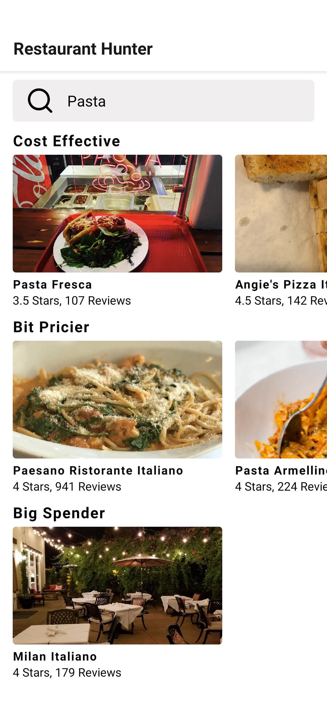

## Restaurant-Hunter

This project uses [Yelp Fusion API](https://www.yelp.com/fusion).

## Getting Started

Getting up and running is as easy as 1, 2, 3.

1. Make sure you have [NodeJS](https://nodejs.org/) and [npm](https://www.npmjs.com/) installed.
2. Install your dependencies

   ```
   cd path/to/Restaurant-Hunter

   npm install -g expo-cli

   npm install
   ```

3. Start your app

   ```
   npm start
   ```

4. Install [Expo](https://play.google.com/store/apps/details?id=host.exp.exponent&hl=en_US) Android Application

5. Scan the QR code and you are good to go.

## Screenshots

</img>

## Support

Please feel free to contact me if you have any questions/concerns.
